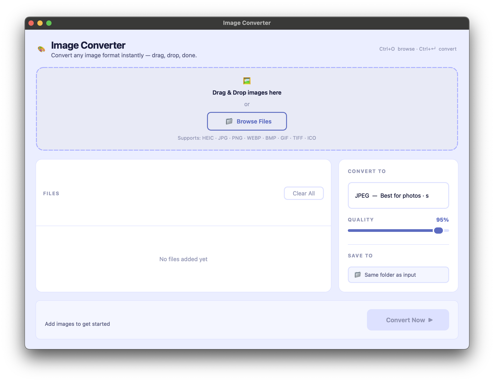
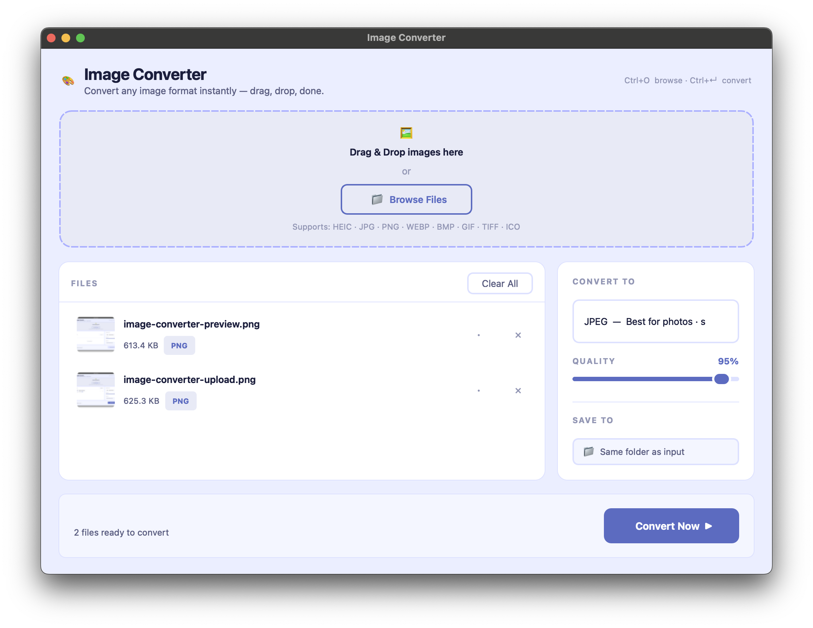

# 🎨 Image Converter


A powerful, universal image converter available as both a **beautiful desktop GUI** and a classic **CLI tool**. Originally built for HEIC to JPEG conversion, it now supports a wide range of formats with a polished, drag-and-drop interface anyone can use.

Useful for converting photos, handling transparency automatically, and batch-processing entire folders effortlessly.

<p align="center">
  
  
</p>

---

## ✨ Features

### 🖥️ Desktop GUI (`app.py`)
* **Drag & Drop**: Drop images or entire folders directly onto the window.
* **Live Thumbnails**: Preview every image before converting.
* **Per-file Status**: See each file tick from ⏳ → ✓ in real-time.
* **Format Picker**: Choose from 8 output formats via a clean dropdown.
* **Quality Slider**: Fine-tune JPEG/WEBP compression (10–100%).
* **Custom Output Folder**: Save to the same folder or pick any destination.
* **Background Conversion**: UI never freezes — conversions run in a worker thread.
* **Open Folder Button**: Jump straight to the output after conversion.
* **Keyboard Shortcuts**: `Ctrl+O` browse, `Ctrl+Enter` convert, `Esc` cancel.
* **Cross-Platform**: Works on macOS, Windows, and Linux.

### ⌨️ CLI (`convert.py`)
* **Batch Conversion**: Convert entire folders at once.
* **Auto-Transparency Handling**: Transparent PNGs convert to a white background for JPEG/BMP.
* **"Convert All" Mode**: Standardise a mixed folder to a single target format.
* **Smart Skipping**: Already-converted files are skipped automatically.

---

## 📦 Supported Output Formats

You can convert your images into any of these formats:
* `JPEG` / `JPG`
* `PNG`
* `WEBP`
* `BMP`
* `GIF`
* `TIFF`
* `ICO`
* `PDF`

*(Input formats can be any of the above, plus HEIC)*

---

## 🚀 Requirements

* Python **3.8+**
* `pip`

Python libraries required:
* `pillow`
* `pillow-heif`
* `PySide6` *(for the GUI)*

---

## 🛠 Installation

1. **Clone the repository:**
   ```bash
   git clone https://github.com/codingnusantara/image-converter.git
   cd image-converter
   ```

2. **Create a virtual environment:**
   ```bash
   python -m venv venv
   ```

3. **Activate the environment:**
   * **macOS / Linux:**
     ```bash
     source venv/bin/activate
     ```
   * **Windows:**
     ```bash
     venv\Scripts\activate
     ```

4. **Install all dependencies:**
   ```bash
   pip install -r requirements.txt
   ```

---

## 📖 Usage

### 🖥️ GUI (Recommended)

Launch the desktop app:

```bash
python app.py
```

Steps:
1. **Drag & drop** images or a folder onto the drop zone, or click **Browse** (`Ctrl+O`).
2. Select the **output format** from the dropdown (JPEG, PNG, WEBP, etc.).
3. Adjust the **quality** slider if needed (JPEG/WEBP only).
4. Choose an **output folder** — defaults to the same folder as the input.
5. Click **Convert** (`Ctrl+Enter`) and watch each file's status update in real-time.
6. Click **Open Folder** to open the output directory when done.

> Press `Esc` to cancel an ongoing conversion.

---

### ⌨️ CLI

Run via terminal using `python convert.py` with optional arguments.

Running without arguments defaults to converting **HEIC → JPG** from the **`photos`** folder.

#### Arguments

| Argument | Description | Default |
|---|---|---|
| `-i` / `--input_folder` | Folder containing the images to convert | `photos` |
| `-f` / `--from_format` | Input format (`heic`, `png`, `webp`, etc.) or `all` | `heic` |
| `-t` / `--to_format` | Output format (`jpg`, `png`, `webp`, `pdf`, etc.) | `jpg` |

#### Examples

**1. Default (HEIC → JPG from `photos`):**
```bash
python convert.py
```

**2. HEIC → PNG:**
```bash
python convert.py -f heic -t png
```

**3. WEBP → JPG:**
```bash
python convert.py -f webp -t jpg
```

**4. All formats → WEBP:**
```bash
python convert.py -f all -t webp
```

**5. HEIC → PDF from a specific folder:**
```bash
python convert.py -i holiday_pics -f heic -t pdf
```

**6. Show help:**
```bash
python convert.py --help
```

---

## 📂 Project Structure

```
image-converter/
│
├── app.py                  <-- Entry point (run this to launch the GUI)
├── convert.py              <-- CLI tool
├── requirements.txt
├── README.md
│
├── ui/                     <-- GUI modules (PySide6)
│   ├── __init__.py
│   ├── constants.py        <-- App-wide constants & color palette
│   ├── stylesheet.py       <-- QSS stylesheet builder
│   ├── helpers.py          <-- Utility functions (thumbnails, formatting)
│   ├── worker.py           <-- Background conversion thread
│   ├── drop_zone.py        <-- Drag-and-drop zone widget
│   ├── file_item.py        <-- Per-file row widget
│   ├── files_panel.py      <-- File list panel
│   ├── settings_panel.py   <-- Format / quality / output settings panel
│   └── main_window.py      <-- Main application window
│
└── photos/                 <-- Place your input files here
    ├── image1.heic
    ├── image2.png
    └── ...
```

---

## 📝 License

MIT License

Free to use, modify, and distribute.
